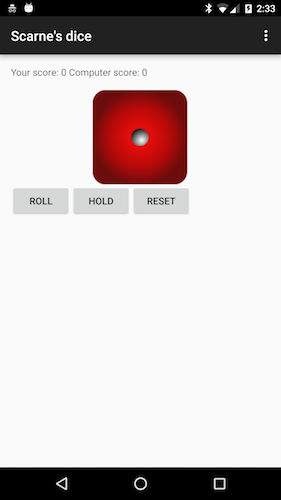

# DiceGame

Here is a fully functional android app which I made in Google Applied CS with android program. 
Dice is a turn-based dice game where players score points by rolling a die. 

#Rules of Game

The game will be played between computer and user.
if they roll a 1, score no points and lose their turn
if they roll a 2 to 6:
add the rolled value to their points
choose to either reroll or keep their score and end their turn
The winner is the first player that reaches (or exceeds) 100 points.

#Screens

</img>

#License

Copyright 2016 Akshay Jain

Licensed under the Apache License, Version 2.0 (the "License");
you may not use this file except in compliance with the License.
You may obtain a copy of the License at

    http://www.apache.org/licenses/LICENSE-2.0

Unless required by applicable law or agreed to in writing, software
distributed under the License is distributed on an "AS IS" BASIS,
WITHOUT WARRANTIES OR CONDITIONS OF ANY KIND, either express or implied.
See the License for the specific language governing permissions and
limitations under the License.
